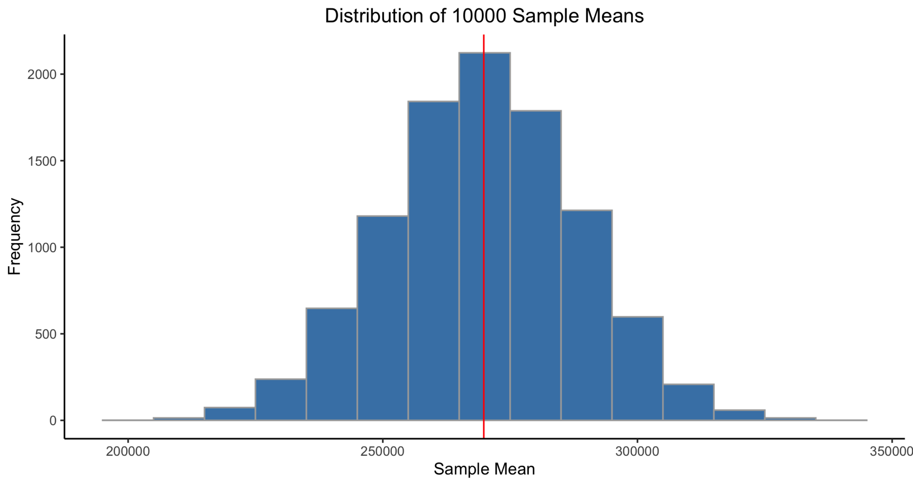
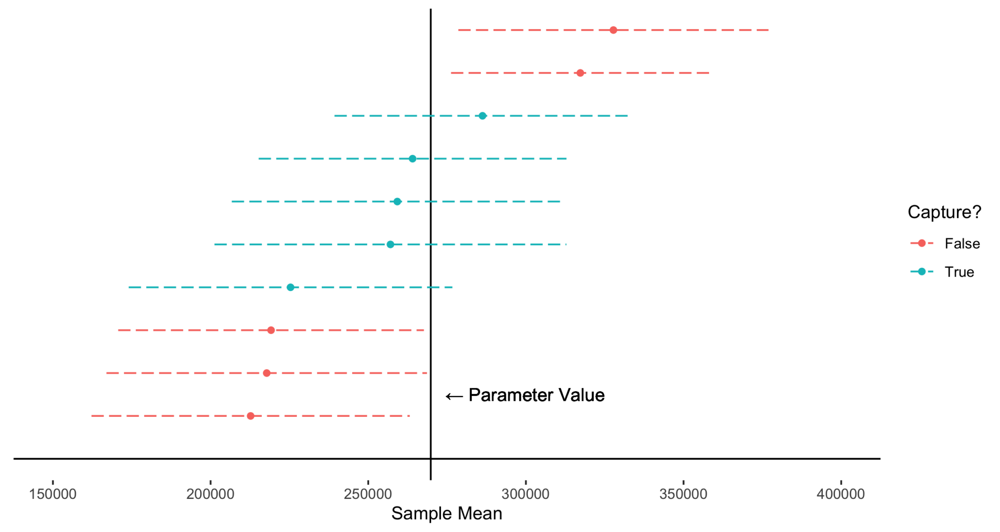

# Introduction
Before we jump into what confidence intervals are, it’s important to go over some basic terminology. In the field of statistics, a **population** is the entire set of things, people, or events that are of interest. For example, if you wanted to know the average height of students in your school, the population is all students in your school. If you wanted to know the average height of all high school students in the U.S., then all high school students in the U.S. is your population. A **parameter** is something you can calculate from the population. In my previous example, the average height is the parameter. 

The problem is that it is usually extremely difficult, impractical, or both to gather data on the population. So, statisticians almost always deal with a **sample**, which is a subset of the population of interest. Then, a **statistic** is something you can calculate from the sample. To continue with the previous example, if you’re interested in the average height of students in your school, you can select 50 students from your school and measure their heights. Those 50 students are your sample and the average height of those 50 students is a statistic. If you selected your sample appropriately (random, independent, and representative of your population), you can make inference on the population and parameter even though you only have data on 50 students.

# Misunderstanding
Similar to the Central Limit Theorem, there are common misconceptions on how to interpret the confidence interval. **A confidence interval does NOT give you the probability of a parameter falling inside the interval.** I'm going to pick on *Investopedia* because it's one of the first websites that come up when you search for confidence interval. This is one of the key takeaways:

> A confidence interval is the probability that a parameter will fall between a pair of values.
> 
> [Investopedia: Confidence Interval](https://www.investopedia.com/terms/c/confidenceinterval.asp) (Accessed on 2021-05-22)

I just claimed this is false. What is the *correct* way to interpret a confidence interval then? I'm going to make use of the Central Limit Theorem, so if you're not familiar, check out my [previous post](./2021-05-17-central-limit-theorem.md)

# What is a confidence interval?
There is a reason why this interval is called the confidence interval and not something else, like a probability interval. In essence, a confidence interval is meant to portray some level of uncertainty. We do this in every day life as well. When someone asks you, “what do you think is the average salary in your company?” You can make an educated guess but you’re not sure (unless you actually know everyone’s salary). So, you would probably say something like “I think it’s about x dollars, give or take a few thousand.” A confidence interval is a statistically rigorous way of saying “give or take”. 

The problem is that a **parameter** is considered to be an *unknown but fixed* value. Bayesian statistics is a little different, but I won’t go into that here. In the above example where someone asks for the average salary at your company, there is an unknown (to you) but fixed (not random) value that is the true average salary at your company. If you knew everyone’s salary, you can easily calculate the average and it wouldn’t change for a given date and time. This is why a 95% or 99% confidence interval doesn’t represent the probability that the parameter falls within that interval. The parameter is a fixed value; there is nothing random about it.

What is interesting to notice is that the **sample** you select from the population is random. If you randomly select 50 people from your company multiple times, you’re probably not going to get the same 50 people every time. This means that the average you calculate from your sample is going to depend on who was selected when you decided to take the sample. The distribution of this sample average is the **sampling distribution** of the sample mean and according to the Central Limit Theorem, this distribution approximates a Normal distribution if certain conditions are met.

Let’s say that a company has 10,000 employees whose salaries range from $40,000 to $500,000. You’re interested in the average salary at this company so you randomly select 50 employees and ask for their salary (assume that people are not hesitant to share this information). 

```r
library(tidyverse)
set.seed(20210523)

# Generate random salaries from Uniform distribution and round to $000's
# This is the population
pop <- round(runif(n=10000, min=40000, max=500000), -3)
param <- mean(pop) # this is the parameter: population average salary

# Randomly sample 50 employees and calculate average
samp1 <- sample(pop, size=50)
mean(samp1)

# Randomly select 50 employees again
samp2 <- sample(pop, size=50)
mean(samp2)
```

When you run the R code above, you’ll notice that the two sample averages are pretty close to the population average but the two samples have different means. This is due to the random nature of selecting the sample. Additionally, due to time and cost, you usually only have a single sample from the population. This means that when you construct a confidence interval from the sample you obtained, the population parameter can either fall inside the interval or outside the interval. **Notice that you would have no way of knowing whether the sample you collected generated a confidence interval that captured the parameter!** 

The confidence level (95%, 99%, etc) indicates that if you were to draw samples many, many times from the same population and checked how many of them contained the population parameter, you will see that about 95% (or whatever your desired confidence level is) of the generated intervals will have contained the population parameter. Still confused? The R code below is going to draw a sample of 50 people from the same population, construct a confidence interval, and see if the population parameter falls inside the interval. We’ll do this 10,000 times.

```r
# Simulate sampling multiple times from the population
numSim <- 10000
contain <- 0 # counter

# obtain critical value from t-distribution with n-1 degrees of freedom
n <- 50
crit <- qt(p=0.995, df=n-1) # for 99% confidence interval

# initialize result matrix
results <- matrix(NA, nr=numSim, nc=4) 
colnames(results) <- c("sample.mean", "ci.lower", "ci.upper", "capture")
results[,4] <- FALSE

for (i in 1:numSim){
  samp <- sample(pop, size=n)
  samp_mean <- mean(samp)
  samp_se <- sd(samp) / sqrt(n) # standard error
  
  # construct confidence interval
  me <- samp_se * crit # margin of error
  ci_lower <- samp_mean - me # lower bound
  ci_upper <- samp_mean + me # upper bound
  
  # keep results for visualization
  results[i,1] <- samp_mean
  results[i,2] <- ci_lower
  results[i,3] <- ci_upper
  
  # count up if the interval contains the population parameter
  if (ci_lower <= param && param <= ci_upper){
    results[i,4] <- TRUE
    contain <- contain + 1
  }
}

# Print proportion of intervals containing the parameter
print(contain / numSim)
```

You will see that the proportion of intervals containing the population parameter is around 0.99. This is what we expect since we wanted a 99% confidence interval. As you increase the number of simulations (try setting numSim to 100,000), the proportion will tend toward 0.99. 

```r
# Visualization
results <- as_tibble(results) #convert matrix to tibble for visualization

# Histogram of sample means
ggplot(results, aes(x=sample.mean))+
  geom_histogram(color="darkgray", fill="steelblue", binwidth=10000) +
  geom_vline(xintercept=param, color="red") +
  theme_classic() +
  labs(title=paste("Distribution of", numSim, "Sample Means"), x="Sample Mean", y="Frequency") +
  theme(plot.title = element_text(hjust=0.5))
```



In the above plot, you’ll notice that the sampling distribution is close to a Normal distribution, as expected per the Central Limit Theorem. The red vertical line represents the population parameter value. If you were to pick a random value from the sampling distribution and construct a confidence interval around it, many of them would capture the red line. However, if you happened to choose extreme values at the tails of the distribution, intervals generated from those extreme values may not be long enough to capture the red line. This means that if you want to make sure that your interval captures the parameter, you can widen the interval (increase the confidence level). Another way is to increase the sample size. Here, we took a sample of 50 people, but it you took a sample of 100 people, your estimates would be more accurate. In terms of the sampling distribution, this means that the distribution will become narrower.

I hope this makes you realize that the randomness comes from the sample. So, the “confidence” in confidence interval refers to our confidence in the process of generating the interval. Therefore, the correct way to interpret a confidence interval is: “**We are x% confident that the interval from a to b will capture the population parameter.**” Why? Because the interval we generated from our sample is one of many possibilities and we a certain proportion (our confidence level) of those possibilities will have generated confidence intervals that capture the population parameter. Take a look at this plot that shows a few sample means, their respective confidence intervals, and whether the interval captures the parameter value.

```r
# Sample 5 CIs that captured the parameter and 5 that did not capture the parameter
success <- results %>%
  filter(capture==TRUE) %>%
  slice_sample(n=5)

failure <- results %>%
  filter(capture==FALSE) %>%
  slice_sample(n=5)

stacked <- rbind(success, failure) %>%
  arrange(sample.mean) %>%
  mutate(index = row_number(),capture=as_factor(capture))

# Plot them
ggplot(stacked,aes(y=index)) +
  coord_cartesian(xlim=c(150000,400000)) +
  geom_hline(yintercept=0) +
  geom_point(aes(x=sample.mean, color=capture)) +
  geom_vline(xintercept=param) +
  geom_segment(aes(x=ci.lower, xend=ci.upper, yend=index, color=capture), linetype="longdash") +
  geom_text(aes(x=param, y=1.5, label="← Parameter Value"), nudge_x=30000) +
  theme_classic() +
  theme(axis.line.y = element_blank(),
        axis.line.x = element_blank(),
        axis.ticks.y = element_blank(),
        axis.text.y = element_blank(),
        axis.title.y = element_blank()) +
  scale_color_discrete(name="Capture?", labels=c("False","True")) +
  labs(x="Sample Mean")
```



It is very important to remember that we don’t assign any level of confidence or probability to the parameter. **The parameter is not random; the samples and their corresponding means/intervals are!**

# Conclusion
Honestly, the correct way to interpret a confidence interval is not intuitive. We’re used to assigning probabilities to indicate our degree of belief about some unknown thing. In fact, this is exactly how Bayesian statistics view probabilities. I will cover Bayesian statistics in a future post.

I hope this clears up any misconceptions about the confidence interval and gives you a better understanding of why we must interpret confidence intervals in a specific manner.