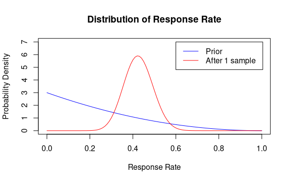
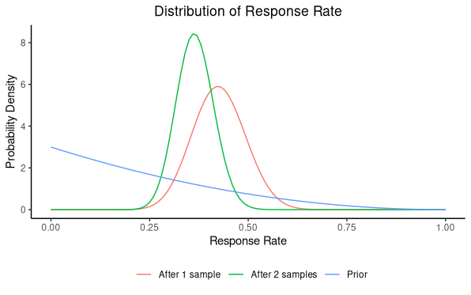

# Defining probability
Bayesians and frequentists (traditional statisticians) have a fundamental difference in philosophy. They disagree on what the word "probability" means. In simple terms, frequentists define probability as the relative frequency (hence the name) of a desired event of a random process. Let's say we want to know the probability of a coin landing heads up from a coin flip. Assuming the coin is fair, we can expect to see heads roughly half the time if we keep flipping the same coin. In a strictly frequentist point of view, you would say that if you were to flip this coin an *infinite* number of times, the relative frequency of heads will approach one half; so, the **probability** of getting heads from a fair coin is $\frac{1}{2}$. Note that the probability is assigned to the long-term process, not the individual event. This distinction comes into play when we look at hypothesis testing and confidence intervals later.

While this approach makes sense for actions or processes that are repeatable, like a coin flip or a dice roll, most events in the world are not repeatable. Yet, we would like to assign some level of likelihood - whether based on facts, expert knowledge, or gut feeling - that some event may happen. There is no way of assigning probability to these types of events using strictly frequentist statistics. This is where Bayesians come in. Bayesians claim that probability represents our *degree of belief* of some event happening. We actually do this in everyday language. If someone asks you, "what's the likelihood that you're going to exercise tomorrow?" You can give an educated guess (or your degree of belief) on the likelihood, even if you've never been asked this question before.

This subjectivity in defining probability is why most frequentists are uncomfortable with Bayesian statistics. Well, I would argue that frequentist statistics also has subjectivity. It's just pushed to a different part of the decision making process. Anyone who has taken introductory statistics courses would have heard of the *p*-value. In frequentist statistics, the *p*-value doesn't represent the probability that your hypothesis is true. It represents the probability of selecting a sample that is as extreme or more extreme than the one you selected. Let's say your hypothesis is that the average weight of everyone in your postal code is 150 pounds. If you sample 100 people and the average weight of those 100 people came out to 180 pounds, there are two possibilities: (1) your hypothesis is wrong and your sample reflects that fact or (2) your hypothesis is correct but your sample is not representative or just happened to have selected heavier individuals by random chance! You would never know what the truth is without actually weighing everyone in your postal code. So, in practice, statisticians use 0.05 as a cutoff for whether there is "statistically significant" evidence. There's nothing special about 0.05, of course. You could use 0.01, 0.6, 0.0003, or whatever suits your fancy. This is where the subjectivity in frequentist statistics lies. In contrast, Bayesian statistics would be able to tell you the probability of your hypothesis being true. Both frequentist statistics and Bayesian statistics have some level of subjectivity and that's ok.

# Bayes' Theorem
Bayesian statistics is baed on (surprise, surprise) Bayes' theorem, named after Reverend Thomas Bayes. Bayes' theorem gives the probability of an event given some other prior knowledge. Let's say $A$ represents the event that you rolled a 6 from a fair, six-sided die in a single try and $B$ represents the event that the sum of two dice rolls is at least 10. Let's try to find the probability for each event. It's obvious that $P(A) = \frac{1}{6}$ given the facts. What about $P(B)$? You can have the first die roll a 4 and the second die roll a 6, or vice versa. You can also have both roll 5s. Similarly, you can have (5,6), (6,5), or (6,6), which all sum to at least 10. There are a total of 36 different ways to roll two dice (6 for each die). Therefore, $P(B) = \frac{6}{36} = \frac{1}{6}$. All possible combinations that meet both criteria are: (4,6), (6,4), (5,5), (5,6), (6,5), (6,6)

Now, what if the first die turns out to be a 6 (event $A$) and you want to know the probability of the two rolls summing to at least 10 (event $B$)? You already rolled a 6, so you have to roll at least a 4 for the second die. The probability of rolling a 4, a 5, or a 6 is $\frac{3}{6} = \frac{1}{2}$. This is the conditional probability of event $B$ given event $A$. Using Bayes' Theorem:

```math
P(B|A) = \frac{P(A|B) \cdot P(B)}{P(A)} = \frac{\frac{3}{6}\cdot\frac{1}{6}}{\frac{1}{6}} = \frac{1}{2}
```

I obtained $P(A|B)$ (read probability of A given B) by counting the number of events in which the first die is 6 in the list above. While this trivial example doesn't seem like it's *that* useful, it serves as the foundation to the entire field of Bayesian statistics beacuse it allows statisticians to calculate probabilities that are extremely difficult to measure in some cases. For instance, imagine you have a medical test that is 95% accurate and 90% specific. This means that if you are actually sick, the test can correctly identify that with 95% probability and if you are healthy, it can correctly identify that you are not sick with 90% probability. However, when doctors look at the exam result, they can only see that the test came back positive or negative. Now, given that the test came back positive, what's the probability that you are sick? If we assume that the probability of being sick is 1% based on your age, sex, etc.,

```math
\begin{aligned}
P(Sick | Positive) &= \frac{P(Positive | Sick) \cdot P(Sick)}{P(Positive)}\\
\\
&=\frac{P(Positive | Sick) \cdot P(Sick)}{P(Positive | Sick) \cdot P(Sick) + P(Positive | Healthy) \cdot P(Healthy)}\\
\\
&=\frac{0.95\times0.01}{0.95\times0.01 + (1-0.1)\times(1-0.01)}\\
\\
&\approx 0.088
\end{aligned}
```

Even with a 95% accurate test, we see that the probability of actually being sick is just shy of 9% when we see a positive test result. If the probability of being sick is 0.1% in your age group, then the probability that you are sick is less than 1% even if you get a positive test result. This should make intuitive sense. If you’re young and healthy, it’s probably more likely that the test returned a false positive.

# Power of Bayesian Statistics
The above example is cool and all, but we still assumed that we knew the probability of being sick in your cohort, which is backed by data (or relative frequency of patients in your cohort). This may not seem too different from frequentist statistics. Well, it gets interesting when you don’t have any data yet or have very little data.

Let’s say you developed a new survey and believe it will have a higher response rate than the existing survey. A frequentist approach is to send out the new survey to a sample of people and compare it to historical response rates of the existing survey, or conduct A/B testing by using the existing survey to some people and the new survey to others and compare response rates. Either way, frequentists will conduct a hypothesis test to see if the response rate of the new survey is statistically significantly different from the existing survey. They can also create a confidence interval for the response rate, which represents the probability of selecting a sample that captures the true response rate. Remember that the confidence interval doesn’t tell you the probability of capturing the true parameter value (check out my [other post](2021-05-23-confidence-intervals.md) if you’re shaky on confidence intervals). So, if the 95% confidence interval is $(0.2, 0.4)$, it doesn’t mean that there is a 95% chance that the true response rate is between 0.2 and 0.4. In frequentist statistics, the true response rate (or parameter) is a fixed value and not random, meaning you cannot assign probability to the parameter value. This comes from the fact that frequentists see probability as a relative frequency of an event of interest in a long-term random process.

In Bayesian statistics, however, probability represents a degree of belief, so it’s not against the rules to assign probabilities to parameters. A 95% Bayesian confidence interval (more commonly known as “credible intervals”) of $(0.2, 0.4)$ would exactly mean what we intuitively think: the true response rate of the new survey is within the interval $(0.2, 0.4)$ with 95% probability. To expand on the survey example, let’s say you consult an expert (or make an educated guess) that the response rate follows a $Beta(1,3)$ distribution, which looks like the following:


```r
# Assumptions
alpha0 <- 1
beta0 <- 3
pi.vals <- seq(0,1,by=0.01)
prior <- dbeta(pi.vals,alpha0,beta0)

# Distribution Plot
plot(pi.vals,prior,type="l",col="blue",main="Distribution of p",
     xlab="Probability (p)",ylab="Probability Density",
     xlim=c(0,1),ylim=c(0,7))

# 95% Credible Interval
paste0("The 95% credible interval is: (",round(qbeta(0.025,alpha0,beta0),2),
       ", ",round(qbeta(0.975,alpha0,beta0),2),")")
```

Your 95% credible interval for the response rate is $(0.01, 0.71)$, which means that the true response rate is within 0.01 and 0.71 with 95% probability. And we were able to calculate this even without even trying out the new survey! You may notice that the interval is very wide and pretty much useless at this point. So let’s gather some data to improve our estimate. You give out 50 surveys and 22 people respond (44% response rate). Let’s see what happened to our distribution and credible interval.



```r
# Collect data
alpha1 <- alpha0 + 22
beta1 <- beta0 + 50 - 22
post <- dbeta(pi.vals,alpha1,beta1)

# Distribution Plot
plot(pi.vals,prior,type="l",col="blue",main="Distribution of p",
     xlab="Response RAte (p)",ylab="Probability Density",
     xlim=c(0,1),ylim=c(0,7))
lines(pi.vals,post,col="red")
legend(0.6,7,c("Prior","Posterior"),col=c("blue","red"),lty=c(1,1))

# 95% Credible Interval
paste0("The 95% credible interval is: (",round(qbeta(0.025,alpha1,beta1),2),
       ", ",round(qbeta(0.975,alpha1,beta1),2),")")
```
Don’t worry about exactly how the math works out right now. What’s important is that the distribution of the response rate is much narrower now. The 95% credible interval is $(0.3, 0.56)$. Since our sample showed a 44% response rate, it makes sense that the credible interval focused around that value.

You can go out and gather more data and improve your precision. If you surveyed an additional 50 people and this time only 13 people responded (26% response rate), the distribution will shift to reflect this fact. The green line below is centered around 0.3, because it’s considering the information from our prior belief and our two samples.



```r
# Collect more data
alpha2 <- alpha1 + 15
beta2 <- beta1 + 50 - 15
post2 <- dbeta(pi.vals,alpha2,beta2)

# Distribution plot
plotdata <- tibble(pi=pi.vals, prior=prior, post1=post, post2=post2) %>%
  pivot_longer(cols=c(prior,post1,post2))

ggplot(data=plotdata, aes(x=pi)) +
  geom_line(aes(y=value,color=name)) +
  theme_classic() +
  labs(title = "Distribution of Response Rate", x="Response Rate", y="Probability Density") +
  theme(plot.title = element_text(hjust=0.5), legend.position = "bottom") +
  scale_color_discrete(name="",labels=c("After 1 sample","After 2 samples", "Prior"))

# 95% Credible Interval
paste0("The 95% credible interval is: (",round(qbeta(0.025,alpha2,beta2),2),
       ", ",round(qbeta(0.975,alpha2,beta2),2),")")
```

Not only did the distribution shift left to reflect the new data, which had a lower response rate than the first sample, but it also became narrower than the distribution from a single sample. Our 95% credible interval is now $(0.28, 0.46)$. So, the width of our credible interval started at 0.7 when we only had an educated guess, narrowed to 0.26 with the first sample, and further narrowed to 0.18 with the second sample. You can keep gathering more data until you hit a desired level of precision.

# Conclusion
I hope this post gives enough information to appreciate the power of Bayesian statistics and why it’s becoming more prevalent. Bayesian inference gives a more intuitive interpretation of results compared to frequentist methods, in my opinion. This is most obvious when looking at confidence intervals or hypothesis tests. Decision makers who are not well-versed in statistics will be confused by the implication of the level of confidence or the *p*-value. Bayesian inference gives a much more intuitive result that states the probability of something being true. Often times, this is the information that decision makers care about.

Bayesian models are also more flexible when dealing with multiple layers of uncertainty. For example, imagine that the response rate from our example above is required for another model. Frequentist models will have to assume that the response rate is a fixed value, which can underestimate the uncertainty associated with the result. On the other hand, Bayesian models can be hierarchical and propagate the uncertainty of not knowing the true response rate through multiple layers and reflect that uncertainty in the outcome.

I’m a little disappointed that most statistics programs rarely teach Bayesian statistics, as it is such a powerful tool. Both frequentist and Bayesian statistics have their place. Frequentist methods are much more straightforward to implement and can be powerful when the data comes from designed experiments where sources of uncertainty are well-controlled. Bayesian methods are capable of dealing with multiple sources of uncertainty and give intuitive interpretations of results for non-statisticians. I strongly encourage aspiring statisticians and data scientists to familiarize themselves with Bayesian statistics.

