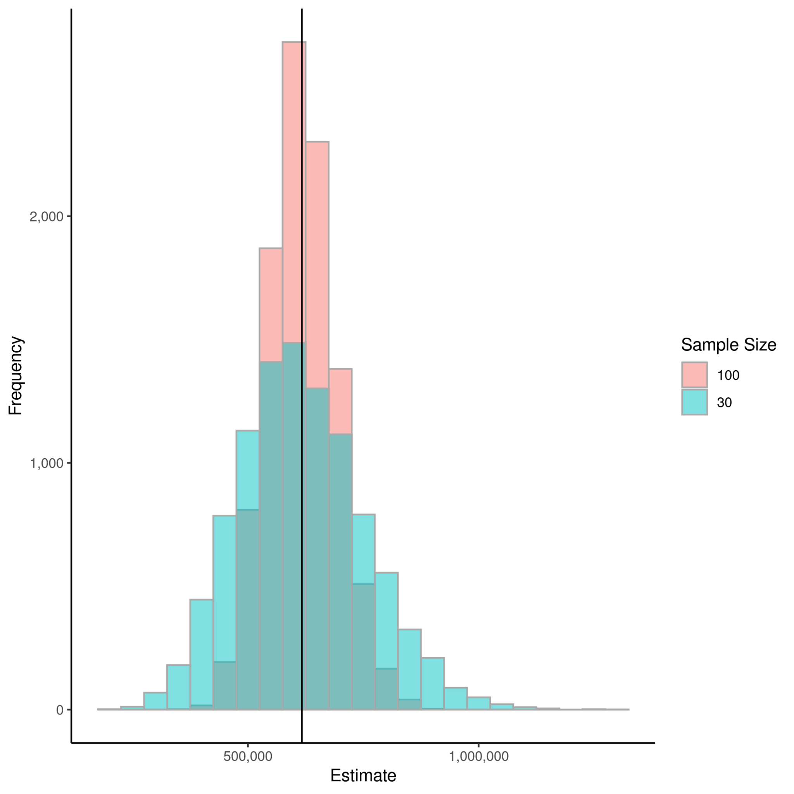
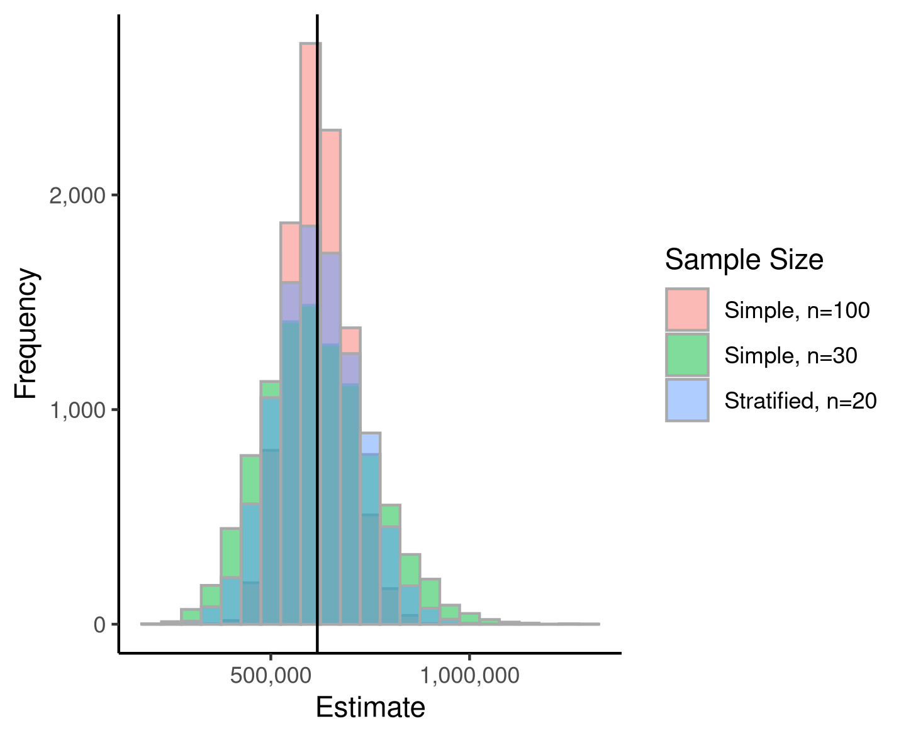

In statistical sampling, stratification is a strategy used to improve precision (lower standard error) of the estimate while maintaining a reasonable sample size. Before we can talk about stratification, we first have to cover what simple random sampling is.

# "Regular" Sampling
Simple random sampling is perhaps the most well-known sampling strategies to non-statisticians. Under simple random sampling, all units in a given population has a non-negative and equal chance of selection. For example, say that the population size is 1000 people and I want to use simple random sampling to select 30 people. Each person would have the same probability of being selected. While this strategy is relatively simple to implement, we can be slightly smarter in our sampling strategy to obtain the same results with a smaller sample or obtain better precision while maintaining the same number of samples: stratification.

# Common Terminology
Before we can jump into how stratification works, we need to go over some common terminology:
* **Population** (or **Sampling Frame**): The set of all records of interest from which we draw samples. It's also known as "the universe."
* **Sample**: A subset of the population.
* **Sampling Unit**: An indivisible object from which responses and measurements are taken. For example, if the population lists project costs, the sampling unit is a project. It's also known as the analysis unit.
* **Stratum** (**Strata** for plural): A group (or groups) of sampling units in which the probability of selection is independent of sampling units in other strata.

# Examples
## Simple Random Sampling
Stratification is commonly used in auditing. So, let’s say you’re tasked with auditing expense records for a local company. The company has an internal bookkeeping system, which contains 1000 records for the year. The company knows that not all expenses are entered correctly because people make mistakes and some people just use their corporate credit cards for personal uses. You’ve been tasked to estimate the total business expense incurred over the year. Because it’s infeasible to go through all 1000 records, if you select a sample of records, the accounting team will audit those selected records and tell you how much of that expense was business-related versus personal. For simplicity, let’s say that an expense record can be all personal (0% business), 50% business, 70% business, 90% business, or all business-related. We wouldn’t know how much a given expense record would be business-related until we select it for audit. How should we select the samples so that we can accurately and precisely estimate the total business expense?

With simple random sampling, the only choice is to increase the sample size. As the sample size increases, the standard error of the estimate decreases. Let’s compare two simple random samples: one with sample size of 30 and another with sample size of 100.

```r
library(tidyverse)
set.seed(20210627)

# Generate data
N <- 1000 # Total number of expense records
X <- round(rexp(N, 0.001), 0) # Expense records
p <- c(0, 0.5, 0.7, 0.9, 1) # proportion of business-related expense per record

# Business expense amounts (randomly select from p and multiply expense amount)
Y <- sapply(X, function(x) p[runif(1, 1, 6)]*x)

# The true value we're trying to estimate
param <- sum(Y)
pop <- as_tibble(cbind(X, Y)) %>% mutate(ID=row_number())
```

For sake of this example, let’s say that we know the true value of the total business expense. The true value is $616,954. Here, we’re going to multiply the sample mean and the population size to get an estimate of the total business expense amount. Since the sample mean is an unbiased estimator for the population mean, this estimator (called the Mean Per Unit or MPU estimator) is also unbiased.

```r
# sample size of 30 using simple random sampling
n <- 30
g <- N*(N-n)/n
t = qt(0.975, df=n-1)
assign(paste0("sample_", n), pop %>% slice_sample(n=n) %>%
  rename(x=X, y=Y) %>%
  summarize(SampleSize = n, EstTotal = mean(y)*N, SE=sqrt(g*var(y)), ME=SE*t, RP=ME/EstTotal))

# sample size of 100 using simple random sampling
n <- 100
g <- N*(N-n)/n
t = qt(0.975, df=n-1)
assign(paste0("sample_", n), pop %>% slice_sample(n=n) %>%
   rename(x = X, y = Y) %>%
   summarize(SampleSize = n, EstTotal = mean(y)*N, SE=sqrt(g*var(y)), ME=SE*t, RP=ME/EstTotal))
```

| **Sample Size** | **Estimated Total Business Expense** | **t critical value** | **Standard Error** | **Margin of Error** | **Relative Precision** |
| :-:             | :-:                                  | :-:                  | :-:                | :-:                 | :-:                    |
| 30              | 855,810                              | 2.045                | 185,317            | 379,015             | 44.3%                  |
| 100             | 713,650                              | 1.984                | 84,555             | 167,775             | 23.5%                  |


As expected, the larger sample has a much lower standard error and a better estimate. Relative precision is simply the margin of error divided by the estimate. We can see that more than tripling our sample size only yielded in halving the standard error. The plot below shows the sampling distribution of the estimate over 10,000 samples for both sample sizes.

```r
# Distribution of estimates
numSim <- 10000
n1 <- 30
n2 <- 100
results <- matrix(NA, nr=numSim, nc=2)
colnames(results) <- c(n1, n2)
for (i in 1:numSim){
  results[i,] <- c(mean(sample(pop$Y, n1)*N), mean(sample(pop$Y, n2)*N))
}

results2 <- as_tibble(results) %>%
  pivot_longer(cols=c("30", "100"), names_to="sample.size", values_to="estimate")

# Create comparison of sampling distribution of estimates
ggplot(results2, aes(x=estimate, fill=sample.size)) +
    geom_histogram(position="identity", alpha=0.5, binwidth=5e4, color="darkgrey") +
    geom_vline(aes(xintercept=param)) +
    theme_classic() +
    labs(fill="Sample Size", x="Estimate", y="Frequency") +
    scale_x_continuous(labels=scales::comma_format()) +
    scale_y_continuous(labels=scales::comma_format())
```



The black vertical line represents the true value. Both sampling distributions are centered around the true value, as expected given the unbiasedness of the estimator. We can also see that the sampling distribution for the estimator from the smaller sample is wider (higher variance). At this point, we might be content in randomly selecting 100 records for the accounting department to audit and estimate the total business expense based on that sample result. However, consider the fact that this takes time away from their regular duties. Maybe, the accounting department is small, consisting of one or two people. Is there a way to alleviate their work by selecting a *smarter* sample?

## Stratified Sampling
You notice that expense records range from a few dollars up to a few thousand dollars. Then, maybe we should always select the records with the largest amounts for audit since how much of those large expenses are business-related will greatly affect our estimate. Let’s say we want to select expenses greater than $5,000 with certainty. This cutoff is purely arbitrary.

After setting the certainty cases aside, we can also increase the chances of the higher records of being selected. After all, the total expense amount (the known value of 984,485 from `sum(pop$X)`)) suggests that records with only a few dollars won’t affect our estimate too much. One of the simplest ways to divide up our records is to have each stratum contain roughly the same amount in expenses. Let’s say we want four strata with equal amounts in each stratum. We will randomly select four records from each of these four non-certainty strata. This brings our total sample size to 20 (4 from each of the 4 non-certainty strata and another 4 from the certainty stratum).

```r
# Cutoff for certainty stratum. This is arbitrary.
cutoff <- 5000

# Divide population into strata with equal amounts in each stratum
numstrata <- 4
EqAmount <- sum(pop$X)/numstrata

# number of samples for each stratum
nh <- 4

strat <- pop %>%
  arrange(X) %>%
  mutate(cert = ifelse(X >= cutoff, TRUE, FALSE), cumsum=cumsum(X))

# non-certainty
noncert <- strat %>%
  filter(cert==FALSE) %>%
  mutate(strata = 1 + floor(cumsum/EqAmount)) %>%
  group_by(strata) %>%
  mutate(Nh=n(), gh = Nh*(Nh-nh)/nh)

# certainty (sample all)
cert <- strat %>%
  filter(cert==TRUE) %>%
  mutate(strata = numstrata + 1, Nh=n(), gh = 0)

results_strat <- matrix(NA, nr=numSim, nc=1)
for (i in 1:numSim){
  output <- noncert %>%
    group_by(strata) %>%
    sample_n(size=min(n(), nh)) %>%
    summarize(nh = n(), EstTotal = mean(Y) * Nh, .groups="drop") %>%
    unique()

  results_strat[i,] <- sum(output$EstTotal) + sum(cert$Y)
}

results3 <- cbind(results, results_strat)
colnames(results3) <- c("30", "100", "stratified")
results3 <- as_tibble(results3) %>%
  pivot_longer(cols=c("30", "100", "stratified"), names_to="sample.size", values_to="estimate")

# Create comparison of sampling distribution of estimates
ggplot(results3, aes(x=estimate)) +
    geom_histogram(position="identity", alpha=0.5, binwidth=5e4, aes(fill=sample.size), color="darkgrey") +
    geom_vline(aes(xintercept=param)) +
    theme_classic() +
    labs(fill="Sample Size", color="Sample Size", x="Estimate", y="Frequency") +
    scale_x_continuous(labels=scales::comma_format()) +
    scale_y_continuous(labels=scales::comma_format()) +
    scale_fill_discrete(labels=c("Simple, n=100", "Simple, n=30", "Stratified, n=20"))
```



With only 20 records, the sampling distribution of the estimator from the stratified sample is narrower than the simple random sample with size 30. Sure, it’s not as narrow as the one with 100 samples, but we can easily make it better by increasing the number of samples from each stratum a little bit.

We don’t even have to sample the same number of records from each stratum and there is a way to divide the population that minimizes the variance for a given number of strata. We also could have estimated how much wouldn’t qualify as business-related instead since at least 50% of the amount is business-related for most records.

# Conclusion
Even in this small example, you can see that stratification makes our sample significantly more efficient. In one of my work projects, I was able to cut thousands of review-hours for an audit because I used some clever stratification tricks to produce an efficient sample. The client was pleased because the audit was shorter and smoother than expected. Our auditors were pleased because they had fewer items to review.

Statistical sampling can be taught across a couple of semesters in some graduate programs, so I wasn’t going to try to cover everything in this post. My hope is that this nudges some to consider stratification for their next project or decide to take a sampling course.
