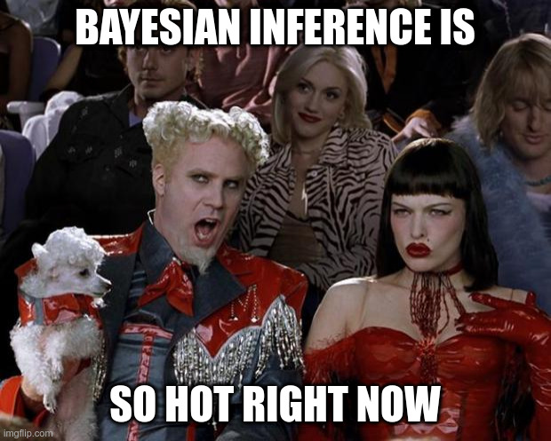

# Introduction
It is no secret that Bayesian statistics – Markov chain Monte Carlo (MCMC) methods in particular – has been gaining popularity in the past couple of decades. I remember making memes in undergrad about how *“Bayesian inference is so hot right now!”* Yes, I made statistics memes.



MCMC samplers like NIMBLE, STAN, and JAGS make implementing MCMC easier and accessible. However, there is a reason why MCMC only became viable in the last couple of decades: computational cost. This issue persists even today when we have more compute power than ever before. The computation time required for MCMC to stabilize increases exponentially with sample size and the number of hyperparameters.

Integrated nested Laplace approximation (INLA) proposed by Rue, Martino, and Chopin in 2009 is a modern tool for Bayesian inference that provides similar insights as MCMC but at a much lower computational burden. Check out this [presentation by John Paige](https://jrfaulkner.github.io/files/INLA_talk.pdf) at the University of Washington in 2017. The last few slides compare the computation time between INLA and MCMC and the difference is staggering. INLA takes a few seconds whereas MCMC takes hours or even longer.

I came across INLA during my last semester at George Mason University. While researching the topic for a class project, I noticed that many resources online compared INLA and MCMC for Gaussian responses. So, I ambitiously set out to compare the performances of the two approaches with respect to inference and prediction in non-Gaussian settings.

# Statistical Methods
## Markov chain Monte Carlo (MCMC)
MCMC is a family of sampling algorithms used to estimate the joint posterior distribution in Bayesian statistics. The two most popular algorithms are the Metropolis-Hastings algorithm and the Gibbs Sampling algorithm, a special case of the Metropolis-Hastings algorithm. There are other better resources online that explain the details of each algorithm much better than I can, so I’m going to simplify a bit here.

Let $p\lparen\theta\mid\mathbf{y}\rparen$ be the posterior distribution of interest, where $\theta$ is the hyperparameter and $\mathbf{y}$ represents the observed data. Then, from Bayes’ Rule, we know that $p\lparen\mathbf{y}\mid\theta\rparen \cdot p\lparen\theta\rparen$ is proportional to the distribution of interest or the target distribution. The Metropolis-Hastings algorithm works in the following way:

1. Choose an arbitrary starting value $\theta^{(0)}$ and an arbitrary proposal density $q$.
2. Draw a candidate value $\theta^*$ for the next iteration given the previous value $\theta^{(i-1)}$ from the proposal density.
3. Calculate the acceptance ratio $\alpha$ (see below).
4. Generate a random number $u$ from $U \sim Unif(0,1)$ and compare to $\alpha$.
5. Reject $\theta^*$ if $u > \alpha$ and set $\theta^{(i)} = \theta^{(i-1)}$; otherwise, $\theta^{(i)}=\theta^*$.

```math
\alpha = \frac{p\left(\mathbf{y}\mid\theta^*\right) \cdot p\left(\theta^*\right)\cdot q\left(\theta^{(i-1)}\mid\theta^*\right)}{p\left(\mathbf{y}\mid\theta^{(i-1)}\right) \cdot p\left(\theta^{(i-1)}\right) \cdot q\left(\theta^*\mid\theta^{(i-1)}\right)}
```

A Gaussian distribution is commonly chosen as the proposal density, but there are other options as well.

Gibbs Sampling works similarly but it always accepts the proposal $\theta^*$. It makes use of the fact that it is easier to sample from a conditional distribution than to marginalize a joint distribution given a multivariate distribution. Let $\boldsymbol{\theta} = \left(\theta_1,\dots,\theta_p\right)$ be a multivariate parameter, where $p$ is the number of parameters. The proposal density for $\theta_j \in \{\theta_k\}_{k=1}^{p}$ is the full conditional distribution $p\left(\theta_j\mid\theta_{-j},\mathbf{y}\right)$ and $\theta_{-j}$ denotes the vector of $\theta$’s not including $\theta_j$ from $\boldsymbol{\theta}$. This means that the acceptance ratio $\alpha$ for $\theta_j$ is:

```math
\begin{align*}
\alpha &= \frac{\left[p\left(\mathbf{y}\mid\theta_j^*,\theta_{-j}^{(i-1)}\right) \cdot p\left(\theta_j^*,\theta_{-j}^{(i-1)}\right)\right] \cdot p\left(\theta_j^{(i-1)}\mid\theta_{-j}^{(i-1)},\mathbf{y}\right)}{\left[p\left(\mathbf{y}\mid\theta_j^{(i-1)},\theta_{-j}^{(i-1)}\right) \cdot p\left(\theta_j^{(i-1)},\theta_{-j}^{(i-1)}\right)\right] \cdot p\left(\theta_j^* \mid \theta_{-j}^{(i-1)},\mathbf{y}\right)}\\
\\
&= \frac{\left[p\left(\theta^*_j \mid \theta^{(i-1)}_{-j},\mathbf{y}\right) \cdot p\left(\theta^{(i-1)}_{-j},\mathbf{y}\right)\right] \cdot p\left(\theta^{(i-1)}_{j}\mid\theta^{(i-1)}_{-j},\mathbf{y}\right)}{\left[ p\left(\theta^{(i-1)}_{j}\mid\theta^{(i-1)}_{-j},\mathbf{y}\right) \cdot p\left(\theta^{(i-1)}_{-j},\mathbf{y}\right) \right] \cdot p\left(\theta^*_j \mid \theta^{(i-1)}_{-j},\mathbf{y}\right)} \\
\\
&= 1
\end{align*}
```

Gibbs Sampling is much more computationally efficient compared to the regular Metropolis-Hasting algorithm for this reason. So, when sampling from a multivariate parameter space is necessary, such as the Gaussian distribution, Gibbs Sampling is preferred.

The core idea behind MCMC is that after a large number of iterations, the random nature of the algorithm will have found the region where the likelihood is maximized. The relative frequency of the accepted values can be plotted to give a rough idea of the posterior distribution. Since it is extremely unlikely that the algorithm started in the correct place, the convention is to set a “burn-in” period for the algorithm to stabilize. Additionally, because the new proposal value is inevitably correlated to its previous value, the practitioner can also specify “thinning” intervals so that only the *n*-th value is recorded.

## Integrated nested Laplace approximation (INLA)
INLA speeds up the Bayesian inference process by employing the following three tactics:

1. Focus on models that can be expressed as latent Gaussian Markov random fields.
2. Split up the joint posterior into a nested product of marginal posteriors.
3. Approximate the marginal posteriors using Laplace approximation.

Rue, Martino, and Chopin claims that inference on marginal posteriors is often sufficient and substantially decreases the computation time. The main benefit of using Laplace approximation is that it converts an integration problem into an optimization problem, a relatively simpler problem. Here’s the gist of how Laplace approximation works.

Let $f(x)$ be a well-behaved unimodal function that is twice-differentiable and achieves its maximum at $x_0$. Let $g(x) = \ln(f(x))$. The goal is to compute

```math
\int_a^b f(x)\ dx = \int_a^b \exp(g(x))\ dx
```

where $a, b$ are potentially infinite. Then, using a Taylor approximation,

```math
\int_a^b \exp(g(x))\ dx \approx \int_a^b\exp\left(g(x_0) + g'(x_0)(x-x_0)+\frac{1}{2}g''(x_0)(x-x_0)^2\right)\ dx
```

Notice that $g'(x_0) = 0$ because the logarithm function is one-to-one and $f(x)$ achieves its maximum at $x_0$ by definition. So,

```math
\begin{align*}
\int_{a}^{b} f(x)\ dx &\approx \int_{a}^{b} \exp\left(g(x_0)+ \frac{1}{2}g''(x_0)(x-x_0)^2\right)\ dx\\
\\
&=\exp\left(g(x_0)\right)\cdot\int_{a}^{b} \exp\left(-\frac{1}{2}\frac{(x-x_0)^2}{-g''(x_0)^{-1}}\right)\ dx\\
\\
&=\exp\left(g(x_0)\right) \cdot \sqrt{\frac{2\pi}{-g''(x_0)}}\cdot\left[\Phi\left(b \mid x_0, -g''(x_0)^{-1}\right)-\Phi\left(a \mid x_0, -g''(x_0)^{-1}\right)\right]
\end{align*}
```

where $\Phi\left(z \mid \mu,\sigma^2 \right)$ is the cumulative distribution function for a Normal distribution with mean $\mu$ and variance $\sigma^2$. Notice that the Normal distribution is centered at the mode $x_0$. The specifics of the INLA algorithm are well-explained [here](https://becarioprecario.bitbucket.io/inla-gitbook/ch-INLA.html).

One major benefit of INLA is that it is fully implemented in R. The code is converted to C++ at runtime, but the `INLA` package allows users to write everything in R without learning a new syntax. While MCMC sampling libraries have a fairly simple syntax, it’s still something the practitioner has to learn. Moreover, because the INLA algorithm focuses on marginal distributions,  parallelization is as easy as setting the desired number of processor  cores. Check out [r-inla](https://www.r-inla.org/) for further details on the R package.

# Results
I won’t go into the details of the study design, but I first generate random data for a number of different scenarios that include Gaussian, Bernoulli, and Poisson responses Then, MCMC and INLA are fit and their respective run times in seconds, mean squared error (MSE) for model parameters, and mean squared prediction error (MSPE) are recorded. Lower is better for all statistics.

## Run times (seconds)

| n    | INLA | MCMC  |
| ---  | ---  | ---   |
| 100  | 0.50 | 12.97 |
| 200  | 0.52 | 14.90 |
| 1000 | 0.67 | 18.84 |
| 2000 | 0.85 | 23.24 |

**Table 1:** Bernoulli response run times

| n    | INLA | MCMC  |
| ---  | ---  | ---   |
| 100  | 0.59 | 11.77 |
| 200  | 0.59 | 13.06 |
| 1000 | 0.80 | 15.45 |
| 2000 | 1.11 | 18.29 |

**Table 2:** Gaussian response run times

| n    | INLA | MCMC  |
| ---  | ---  | ---   |
| 100  | 0.59 | 11.77 |
| 100  | 0.53 | 12.27 |
| 200  | 0.52 | 14.00 |
| 1000 | 0.66 | 18.55 |
| 2000 | 0.84 | 23.96 |

**Table 3:** Poisson response run times

INLA is much faster than MCMC in all scenarios. However, faster computation alone is insufficient. Let's look at inference performances:

## Mean Squared Error (MSE)

| n    | INLA | MCMC   |
| ---  | ---  | ---    |
| 100  | 6.21 | 1.66   |
| 200  | 2.38 | 1.12 |
| 1000 | 0.41 | 0.30   |
| 2000 | 0.19 | 0.15   |

**Table 4:** Bernoulli response MSE

| n    | INLA | MCMC |
| ---  | ---  | ---  |
| 100  | 4.52 | 2.54 |
| 200  | 2.15 | 2.45 |
| 1000 | 0.42 | 1.85 |
| 2000 | 0.21 | 1.32 |

**Table 5:** Gaussian response MSE

| n    | INLA | MCMC |
| ---  | ---  | ---  |
| 100  | 0.93 | 0.62 |
| 200  | 0.46 | 0.34 |
| 1000 | 0.09 | 0.07 |
| 2000 | 0.04 | 0.04 |

**Table 6:** Poisson response MSE

MCMC generally performs better than INLA for smaller datasets and the difference in performance decreases as sample size increases. Surprisingly, INLA performs better than MCMC in the Gaussian setting when the sample sie is greater than 200. Finally, let's examine the prediction performances:

## Mean Squared Prediction Error (MSPE)

| n    | INLA | MCMC |
| ---  | ---  | ---  |
| 100  | 0.43 | 0.43 |
| 200  | 0.42 | 0.41 |
| 1000 | 0.40 | 0.40 |
| 2000 | 0.40 | 0.39 |

**Table 7:** Bernoulli response MSPE

| n    | INLA | MCMC |
| ---  | ---  | ---  |
| 100  | 5.11 | 6.71 |
| 200  | 4.95 | 6.44 |
| 1000 | 4.78 | 6.13 |
| 2000 | 4.78 | 6.09 |

**Table 8:** Gaussian response MSPE

| n    | INLA | MCMC |
| ---  | ---  | ---  |
| 100  | 1.28 | 1.19 |
| 200  | 1.15 | 1.14 |
| 1000 | 1.10 | 1.10 |
| 2000 | 1.08 | 1.08 |

**Table 9:** Poisson response MSPE

For the non-Gaussian responses, INLA and MCMC have almost identical MSPE regardless of sample size. What’s interesting is that INLA performs better than MCMC for the Gaussian response by a noticeable amount.

# Conclusion
MCMC seems to perform slightly better than INLA for non-Gaussian responses with respect to both inference and prediction. However, this comes at a much higher computational cost. In my testing, I purposefully built simple scenarios because I wanted to run the same scenario multiple times to get the performance metrics. Had I designed something more complicated where MCMC takes hours like the scenarios in [John Paige’s presentation](https://jrfaulkner.github.io/files/INLA_talk.pdf), I would not have been able to finish this project. As for Gaussian responses, it seems like INLA has better performance than MCMC except when sample size is a few hundred and the goal is inference rather than prediction. Personally, I would take the minor inference performance penalty of INLA over MCMC for the Gaussian response.

There are some caveats to these results, however. Bayesian models shine when the underlying processes are complex. In cases like this simulation study where all covariates are independent from each other and lacks a hierarchical structure, there is little reason to consider a Bayesian framework. Frequentist methods such as generalized linear models (GLM) run much faster than INLA and they also provide almost identical performance to INLA in these simple cases. While MCMC performs slightly better in terms of MSE, that may be due to the MCMC algorithm being given the exact distribution of the model parameters. Another limitation to this study is the fixed number of covariates. Also, I only explored two types of non-Gaussian responses.

These caveats are mainly due to limited time and computation power as this was a class project and I had to use my personal computer. With more time and computation power, it may be interesting to vary the number of covariates, implement correlation structures between covariates, consider hierarchical structures, or explore other non-Gaussian responses.

# Additional Resources
* [R-INLA Project](https://www.r-inla.org/)
* [Haakon Bakka's Online Course Topics for Bayesian Modeling](https://haakonbakkagit.github.io/organisedtopics.html)
* [Bayesian inference with INLA](https://becarioprecario.bitbucket.io/inla-gitbook/index.html)

